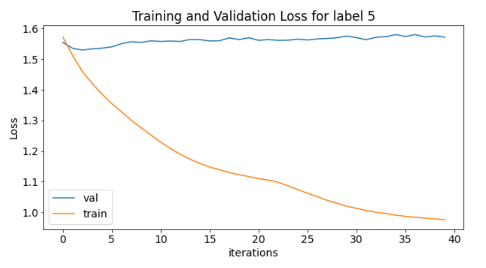
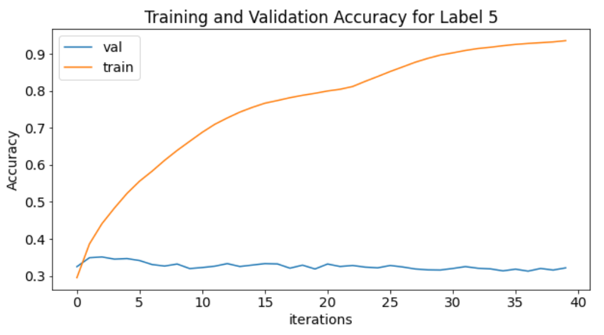
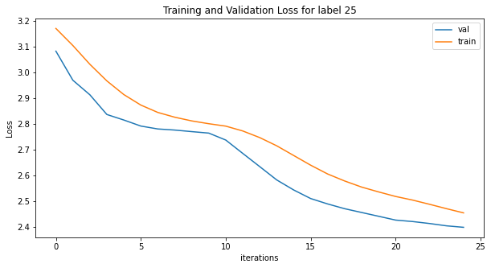
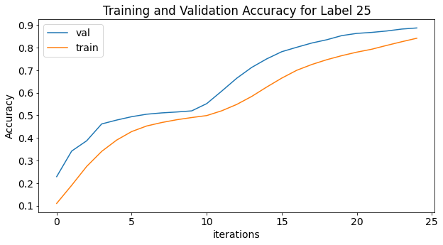

# Standford Sentiment Treebank


- [Objective & Data description](#objective--data-description)
- [Proposed Solution](#proposed-solution)
- [Augmentation](#augmentation)
- [Model and Loss function](#model-and-loss-function)
- [Results: Accuracy, Loss](#results-accuracy-loss)
- [Sample Outcomes](#sample-outcomes)


## Objective & Data description
The Stanford Sentiment Treebank dataset  consists of 11,855 sentences extracted from movie reviews with fine-grained sentiment labels [1–5] (1 most negative and 5 most positive) also converted to a scale of [1-25] where 1 being most negative and 25 being most positive. It also consists of well as 215,154 phrases that compose each sentence in the dataset. This was also to be achieved by using various NLP data augmentation techniques like "random_insertion", "Back Translate", "random_swap" and "random_delete".

## Proposed Solution
Eventhough we have 8545 sentences, still we augment the data using multiple augmentation techniques to increase our data-size to train our models better. For the model, we use a multi-layer LSTM model fed by an embedding layer. To classify the sentences into their perceived sentiment labels from the LSTM layer, we use two fully connected layers with output dimension equal to both the sentiments' labels present in the dataset. 


## Augmentation
Data augmentation in data analysis are techniques used to increase the amount of data by adding slightly modified copies of already existing data or newly created synthetic data from existing data. It acts as a regularizer and helps reduce overfitting when training a machine learning model.
We have used 4 data augmentation techniques:
- **random_insertion**: we randomly insert synonyms of a word at a random position in the sentence
- **random_deletion**: we randomly delete a word from the sentence. This is achieved by generating a random number from a uniform distribution for each of the words in the sentence. This generated number between 0 and 1, and the words smaller than than the pre-defined threshold for every sentence. This allows for a random deletion of some words from the sentence
- **random_swap**: we randomly swap the order of two words in a sentence. To achieve this, we smaple two indices (index1 != index2; index1 & index2 < length of sentence > 1)
- **translate_and_back**: we take a sentence and convert it to a language randomly chosen from the **_google_trans_new_** library's list of languages and then translate it back to english, which is the original language of our tweet. We use translate only 4% of the times to limit the API calls to google server and avoid bad_request timeouts

We augment each of the tweet 6 times, **randomly** choosing one of the 4 augmentation techniques mentioned above with probabilities of 33% each for the first three and 1% for translate_and_back. We have kept our augmentation per tweet to 6 times so as to reduce our data augmentation runtime. This can be exceeded to 16 based on the paper[^1].


## Model and Loss function
As discussed in proposed architecture, we use a model with embedding (600), 3 LSTM and 2 fully connected layers.  First we pass our augmented and original dataset through _spacy_ to tokenize it. We tokenize the training, validation and testing daya individually as our dataset is already split into train-valid-test hence we teh same split to create the bucketiterators. Using train dataset we created a vocabulary.

We use _Adam_ optimiser with a learning rate of 2*10^-4 and _CrossEntropyLoss_ 


Cross entropy loss is used since  it is a multi-class classification problem.
This model was trained for 25 epochs. 
```
Epoch 1 | Time Taken: 37.08s
    Train Loss  5 labels: 1.525 | Train Acc   5 labels: 35.90%
     Val. Loss  5 labels: 1.394 |  Val. Acc   5 labels: 50.08% 

    Train Loss 25 labels: 3.172 | Train Acc 25 labels: 11.04%
     Val. Loss 25 labels: 3.083 |  Val. Acc 25 labels: 22.89% 

Epoch 2 | Time Taken: 37.18s
    Train Loss  5 labels: 1.393 | Train Acc   5 labels: 51.18%
     Val. Loss  5 labels: 1.200 |  Val. Acc   5 labels: 71.13% 

    Train Loss 25 labels: 3.105 | Train Acc 25 labels: 19.06%
     Val. Loss 25 labels: 2.970 |  Val. Acc 25 labels: 34.21% 

Epoch 3 | Time Taken: 37.43s
    Train Loss  5 labels: 1.284 | Train Acc   5 labels: 62.83%
     Val. Loss  5 labels: 1.167 |  Val. Acc   5 labels: 74.57% 

    Train Loss 25 labels: 3.032 | Train Acc 25 labels: 27.41%
     Val. Loss 25 labels: 2.914 |  Val. Acc 25 labels: 38.76% 
.....	 
.....	 
.....
Epoch 23 | Time Taken: 37.60s
    Train Loss  5 labels: 0.945 | Train Acc   5 labels: 96.11%
     Val. Loss  5 labels: 0.931 |  Val. Acc   5 labels: 97.37%

    Train Loss 25 labels: 2.488 | Train Acc 25 labels: 80.99%
     Val. Loss 25 labels: 2.414 |  Val. Acc 25 labels: 87.37%

Epoch 24 | Time Taken: 37.60s
    Train Loss  5 labels: 0.944 | Train Acc   5 labels: 96.28%
     Val. Loss  5 labels: 0.929 |  Val. Acc   5 labels: 97.63%

    Train Loss 25 labels: 2.471 | Train Acc 25 labels: 82.61%
     Val. Loss 25 labels: 2.405 |  Val. Acc 25 labels: 88.21%

Epoch 25 | Time Taken: 37.60s
    Train Loss  5 labels: 0.942 | Train Acc   5 labels: 96.44%
     Val. Loss  5 labels: 0.929 |  Val. Acc   5 labels: 97.63%

    Train Loss 25 labels: 2.455 | Train Acc 25 labels: 84.15%
     Val. Loss 25 labels: 2.399 |  Val. Acc 25 labels: 88.71%
	 
```
As we can see, the model for sentiments [1-5] starts from 50% validation accuracy and 1.394 validation loss which by 25th epoch is decreased to  Val. Loss  5 labels: 0.929 |  Val. Acc   5 labels: 97.63%

Similarly, the model for sentiments [1-25] starts from ~23% validation accuracy and 3.083 validation loss which by 25th epoch is decreased to  Val. Loss al. Loss 25 labels: 2.399 |  Val. Acc 25 labels: 88.71%

## Results: Accuracy, Loss
Post training our model for sentiments' labels [1-5], we get a training accuracy of 96.44% and a validation accuracy of 97.63%.

The training and validation loss the model for sentiments_5 (for sentiments on scale 1-5):



The training and validation accuracy the model for sentiments_5 (for sentiments on scale 1-5):




Post training our model for sentiments' labels [1-25], we get a training accuracy of 84% and a validation accuracy of 88%. 

The training and validation loss the model for sentiments_25 (for sentiments on scale 1-25):



The training and validation accuracy the model for sentiments_25 (for sentiments on scale 1-25):




[^1]  **EDA: Easy Data Augmentation Techniques for Boosting Performance on Text Classification Tasks** (https://arxiv.org/abs/1901.11196)


## Group

- Anirban Mukherjee
- Debasish Sarangi


