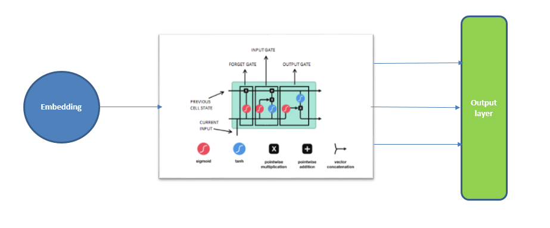
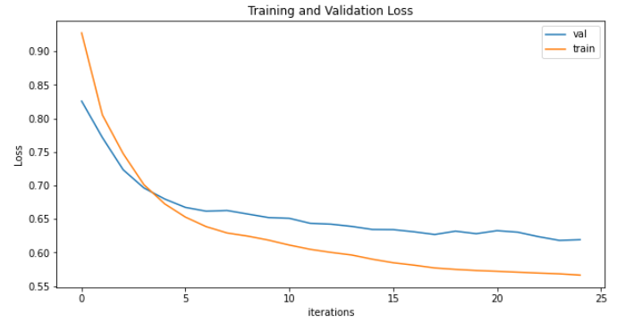
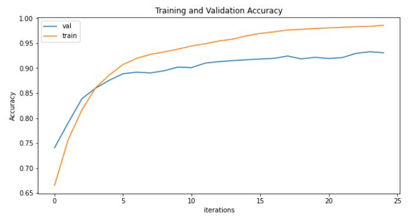
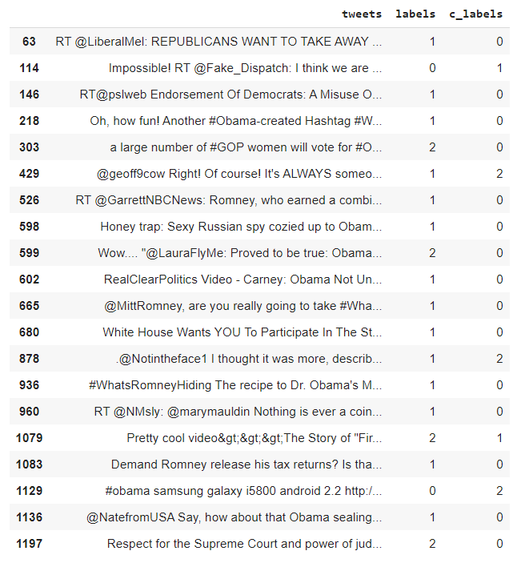

# Twitter Sentiment Analysis 

- [Objective & Data description](#objective--data-description)
- [Proposed Solution](#proposed-solution)
- [Augmentation](#augmentation)
- [Model and Loss function](#model-and-loss-function)
- [Results: Accuracy, Loss](#results-accuracy-loss)
- [Sample Outcomes](#sample-outcomes)

## Objective & Data description
The objective is to classify sentiments of the given tweets from the file 'tweet.csv' provided on canvas. The dataset consists of **1364** tweets with their percieved sentiments as labels. This was also to be achieved by using various NLP data augmentation techniques like "Back Translate", "random_swap" and "random_delete".

## Proposed Solution
Since we only have 1364 tweets, hence we augment the data using multiple augmentation techniques to increase our data-size to train our models better. For the model, we use a multi-layer LSTM model fed by an embedding layer. To classify the tweets into their perceived sentiments from the LSTM layer, we use a fully connected layer with output dimension equal to the number of sentiment labels present in the dataset.

## Augmentation
Data augmentation is really helpful in Computer vision and NLP. It’s really helpful when we have a limited amount of data available and want to give our model a flavour of different ways of 'reading' a text which has the same meaning. We have used 4 data augmentation techniques:
- **random_insertion**: we randomly insert synonyms of a word at a random position
- **random_deletion**: we randomly delete a word if a uniformly generated number between 0 and 1 is smaller than a pre-defined threshold. This allows for a random deletion of some words of the sentence.
- **random_swap**: we randomly swap the order of two words in a sentence.
- **translate_and_back**: we take a sentence and convert it to a language randomly chosen from the **_google_trans_new_** library and then translate it back to english, which is the original language of our tweet.

We augment our data our data 6 times, **randomly**. This means that our augmentation function augments the incoming tweet sentence by randomly choosing one of the 4 techniques used above. 

## Model and Loss function
As discussed above, we use an LSTM model. This model was trained for 25 epochs.
Since it is a multi-class classification problem, we use **_CrossEntropyLoss_** as our Loss function.

## Results: Accuracy, Loss
We used _CrossEntropyLoss_ to measure our loss. The final accuracy of the model was measured by **f1 score** of **98.52%**. 

The training and validation loss the model:

The training and validation loss the model:

## Sample Outcomes
The mis-classification results were evaluated and following were the results:

